# GitHub Actions CI/CD Pipeline

This repository includes a comprehensive CI/CD pipeline with automated testing, security scanning, deployment, and rollback mechanisms.

## 🏗️ Pipeline Overview

```mermaid
graph TD
    A[Push/PR] --> B[CI Pipeline]
    B --> C{Tests Pass?}
    C -->|Yes| D[Security Scan]
    C -->|No| E[❌ Fail]
    D --> F{Security OK?}
    F -->|Yes| G[Build]
    F -->|No| E
    G --> H{Branch?}
    H -->|PR| I[Deploy Preview]
    H -->|develop| J[Deploy Staging]
    H -->|main| K[Deploy Production]
    I --> L[Smoke Tests]
    J --> L
    K --> L
    L --> M{Tests Pass?}
    M -->|Yes| N[✅ Success]
    M -->|No| O[🚨 Rollback Available]
```



## 📋 Workflows

### Core Workflows

1. **[CI/CD Pipeline](workflows/ci.yml)** - Main pipeline for testing and quality checks
2. **[Deployment](workflows/deploy.yml)** - Automated deployment to preview, staging, and production
3. **[Security Scanning](workflows/security.yml)** - Comprehensive security vulnerability scanning
4. **[Database Operations](workflows/database.yml)** - Database migration management
5. **[Post-Deployment Tests](workflows/smoke-tests.yml)** - Automated smoke testing
6. **[Rollback Mechanism](workflows/rollback.yml)** - Emergency rollback procedures

### Supporting Workflows

7. **[Dependency Updates](workflows/dependency-update.yml)** - Automated dependency management

## 🚀 Getting Started

### 1. Initial Setup

1. **Configure Secrets**: Follow the [Setup Guide](SETUP_GUIDE.md) to configure all required secrets
2. **Set Up Environments**: Create `production`, `staging`, and `preview` environments in GitHub
3. **Configure Protection Rules**: Set up branch protection and environment protection rules

### 2. Required Secrets

```bash
# Core Infrastructure
NEXT_PUBLIC_SUPABASE_URL
NEXT_PUBLIC_SUPABASE_ANON_KEY
SUPABASE_SERVICE_ROLE_KEY
SUPABASE_ACCESS_TOKEN
VERCEL_TOKEN
VERCEL_ORG_ID
VERCEL_PROJECT_ID

# Payment Providers
STRIPE_SECRET_KEY
NEXT_PUBLIC_STRIPE_PUBLISHABLE_KEY
YOOKASSA_SHOP_ID
YOOKASSA_SECRET_KEY

# Infrastructure
REDIS_URL
SENTRY_DSN
SNYK_TOKEN

# Deployment URLs
PRODUCTION_URL
STAGING_URL
PREVIEW_URL
```

### 3. Workflow Triggers

| Event | Workflow | Environment | Auto-Deploy |
|-------|----------|-------------|-------------|
| PR → main | CI + Preview | preview | ✅ |
| Push → develop | CI + Deploy | staging | ✅ |
| Push → main | CI + Deploy | production | ✅ |
| Schedule | Security Scan | - | - |
| Manual | Rollback | configurable | - |
| Manual | DB Migration | configurable | - |

## 🧪 Testing Strategy

### Test Types

1. **Unit Tests** - Component and service level testing
2. **Integration Tests** - API endpoint testing
3. **End-to-End Tests** - Full application workflow testing
4. **Security Tests** - Vulnerability and penetration testing
5. **Performance Tests** - Load and stress testing
6. **Smoke Tests** - Post-deployment verification

### Test Commands

```bash
# Local Testing
pnpm test                 # Run all unit tests
pnpm test:watch          # Watch mode for development
pnpm test:unit           # Unit tests only
pnpm test:integration    # Integration tests only
pnpm test:e2e            # End-to-end tests
pnpm test:coverage       # Generate coverage report

# CI Testing
pnpm test:ci             # Full CI test suite
pnpm test:security       # Security testing
pnpm test:load           # Load testing
```

## 🛡️ Security Features

### Automated Security Scanning

- **Dependency Scanning** - Daily vulnerability checks with Snyk
- **Secret Detection** - TruffleHog scans for exposed secrets
- **SAST** - Static application security testing
- **License Compliance** - Automated license checking
- **Docker Security** - Container vulnerability scanning
- **Security Headers** - Verification of security headers

### Security Workflow Schedule

```yaml
# Daily at 2 AM UTC
schedule:
  - cron: '0 2 * * *'
```

## 🚢 Deployment Strategy

### Environment Progression

```
Feature Branch → PR Preview → Staging → Production
```

### Deployment Environments

| Environment | Branch | Auto-Deploy | Protection |
|-------------|--------|-------------|------------|
| **Preview** | PR branches | ✅ | None |
| **Staging** | develop | ✅ | 1 reviewer |
| **Production** | main | ✅ | 2 reviewers + 10min wait |

### Deployment Features

- **Zero-downtime deployments** via Vercel
- **Automatic rollback** on health check failures
- **Database migration automation**
- **Environment variable management**
- **Deployment notifications**

## 🗃️ Database Management

### Migration Workflow

1. **PR Validation** - Syntax and dependency checking
2. **Staging Deployment** - Automatic on main branch
3. **Production Deployment** - Manual trigger with approval
4. **Rollback Support** - Database backup and restore

### Database Commands

```bash
# GitHub Actions (Manual Dispatch)
- Validate migrations
- Run migrations (staging/production)
- Rollback database
- Reset database (staging only)
```

## 🚨 Emergency Procedures

### Rollback Process

1. **Navigate to Actions** → Rollback Mechanism
2. **Select Environment** (staging/production)
3. **Choose Rollback Type**:
   - Previous deployment
   - Specific commit
   - Database only
   - Full rollback
4. **Provide Reason** for audit trail
5. **Execute with Approval**

### Rollback Types

- **Application Rollback** - Revert to previous code version
- **Database Rollback** - Restore database to previous state
- **Full Rollback** - Complete environment restoration
- **Emergency Rollback** - Skip tests for critical issues

## 📊 Monitoring & Observability

### Health Checks

- **Application Health** - `/api/health` endpoint monitoring
- **Database Connectivity** - Connection verification
- **External Services** - Payment gateway status
- **Performance Metrics** - Response time monitoring

### Monitoring Tools

- **Sentry** - Error tracking and performance monitoring
- **Vercel Analytics** - Deployment and runtime metrics
- **GitHub Actions** - Workflow execution monitoring
- **Custom Smoke Tests** - Post-deployment verification

## 🔧 Customization

### Adding New Tests

1. Create test files in appropriate directories:
   - `tests/unit/` - Unit tests
   - `tests/integration/` - Integration tests
   - `tests/e2e/` - End-to-end tests

2. Update workflow files to include new test commands

3. Configure test databases and services as needed

### Adding New Environments

1. Create environment in GitHub Settings → Environments
2. Configure protection rules
3. Add environment-specific secrets
4. Update workflow files with new environment logic

### Custom Notifications

Add notification steps to workflows:

```yaml
- name: Send Slack Notification
  if: failure()
  run: |
    curl -X POST -H 'Content-type: application/json' \
      --data '{"text":"🚨 Deployment failed!"}' \
      ${{ secrets.SLACK_WEBHOOK_URL }}
```

## 📈 Performance Optimizations

### Build Optimizations

- **Turbopack** - Fast bundling with Next.js
- **Incremental Static Regeneration** - Efficient page updates
- **Bundle Analysis** - Automated size monitoring
- **Dependency Caching** - Faster CI/CD execution

### Test Optimizations

- **Parallel Test Execution** - Multiple jobs run simultaneously
- **Test Result Caching** - Skip unchanged test suites
- **Smart Test Selection** - Run only affected tests
- **Coverage Optimization** - Focused coverage reporting

## 🛠️ Troubleshooting

### Common Issues

| Issue | Solution |
|-------|----------|
| **Secrets not found** | Verify secrets are configured in correct environment |
| **Tests failing** | Check test database connections and environment variables |
| **Deployment failures** | Verify Vercel token and project configuration |
| **Migration errors** | Check Supabase CLI authentication and permissions |

### Debug Commands

```bash
# Enable debug logging
ACTIONS_STEP_DEBUG=true
ACTIONS_RUNNER_DEBUG=true

# Local debugging
pnpm test:setup          # Initialize test environment
pnpm db:status          # Check database status
pnpm type-check         # Verify TypeScript compilation
```

### Useful Links

- [GitHub Actions Documentation](https://docs.github.com/en/actions)
- [Vercel Deployment Guide](https://vercel.com/docs/deployments)
- [Supabase CLI Reference](https://supabase.com/docs/reference/cli)
- [Jest Testing Framework](https://jestjs.io/docs/getting-started)

## 📞 Support

- **Issues** - Create GitHub issues for workflow problems
- **Security** - Report security vulnerabilities via [SECURITY.md](SECURITY.md)
- **Documentation** - Check [SETUP_GUIDE.md](SETUP_GUIDE.md) for detailed setup instructions

---

🚀 **Happy Deploying!** The CI/CD pipeline is designed to be robust, secure, and efficient. For questions or improvements, please open an issue or submit a pull request.
