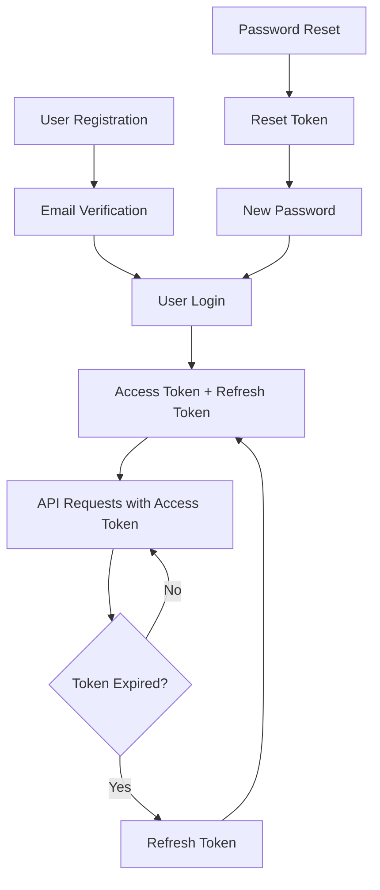

# Authentication API Guide

## Overview

This guide covers the comprehensive authentication API endpoints for the digital marketplace. All endpoints include rate limiting, input validation with Zod, proper HTTP status codes, and security best practices.

## Base URL

```
https://your-domain.com/api/auth
```

## Authentication Flow



## Rate Limiting

All endpoints implement rate limiting with the following configurations:

| Endpoint | Window | Max Requests | Purpose |
|----------|--------|--------------|---------|
| `/register` | 1 hour | 3 | Prevent spam registrations |
| `/login` | 15 minutes | 5 | Prevent brute force attacks |
| `/forgot-password` | 1 hour | 3 | Prevent email enumeration |
| `/reset-password` | 1 hour | 3 | Prevent token abuse |
| `/verify-email` | 5 minutes | 3 | Prevent verification spam |
| `/refresh` | 15 minutes | 5 | Prevent token refresh abuse |

## Common Response Headers

All responses include rate limiting headers:

```
X-RateLimit-Limit: 5
X-RateLimit-Remaining: 3
X-RateLimit-Reset: 2024-01-01T12:00:00Z
Retry-After: 900
```

## API Endpoints

### 1. User Registration

**POST** `/api/auth/register`

Creates a new user account with email verification.

#### Request Body

```json
{
  "email": "user@example.com",
  "password": "SecurePass123!",
  "name": "John Doe",
  "role": "buyer",
  "terms_accepted": true
}
```

#### Validation Rules

- `email`: Valid email format, required, max 255 characters
- `password`: Min 8 chars, must contain uppercase, lowercase, number, special character
- `name`: Required, max 100 chars, only letters, spaces, hyphens, apostrophes
- `role`: Optional, defaults to "buyer", must be one of: buyer, seller, partner, admin
- `terms_accepted`: Must be true

#### Success Response (201)

```json
{
  "success": true,
  "message": "Registration successful. Please check your email for verification.",
  "data": {
    "user": {
      "id": "uuid",
      "email": "user@example.com",
      "name": "John Doe",
      "role": "buyer",
      "email_verified": false,
      "created_at": "2024-01-01T12:00:00Z"
    }
  }
}
```

#### Error Responses

**400 - Validation Error**
```json
{
  "success": false,
  "error": "Validation failed",
  "code": "VALIDATION_ERROR",
  "details": {
    "errors": [
      {
        "field": "password",
        "message": "Password must contain at least one special character"
      }
    ]
  }
}
```

**429 - Rate Limit Exceeded**
```json
{
  "success": false,
  "error": "Too many registration attempts. Please try again later.",
  "retryAfter": 3600
}
```

### 2. User Login

**POST** `/api/auth/login`

Authenticates a user and returns access/refresh tokens.

#### Request Body

```json
{
  "email": "user@example.com",
  "password": "SecurePass123!",
  "remember_me": false
}
```

#### Success Response (200)

```json
{
  "success": true,
  "message": "Login successful",
  "data": {
    "user": {
      "id": "uuid",
      "email": "user@example.com",
      "name": "John Doe",
      "avatar_url": "https://...",
      "role": "buyer",
      "is_active": true,
      "email_verified": true,
      "last_login_at": "2024-01-01T12:00:00Z"
    },
    "session": {
      "id": "session-uuid",
      "expires_at": "2024-01-01T12:15:00Z",
      "status": "active"
    }
  }
}
```

#### Cookies Set

- `access_token`: Short-lived (15 minutes)
- `refresh_token`: Long-lived (7 days or 30 days if remember_me)
- `session_id`: Session identifier

#### Error Responses

**401 - Authentication Failed**
```json
{
  "success": false,
  "error": "Invalid email or password",
  "code": "LOGIN_FAILED"
}
```

### 3. User Logout

**POST** `/api/auth/logout`

Invalidates the current user session.

#### Request Body (Optional)

```json
{
  "session_id": "session-uuid"
}
```

#### Success Response (200)

```json
{
  "success": true,
  "message": "Logout successful"
}
```

#### Cookies Cleared

All authentication cookies are cleared from the client.

### 4. Token Refresh

**POST** `/api/auth/refresh`

Refreshes expired access tokens using refresh token.

#### Request Body (Optional)

```json
{
  "refresh_token": "refresh-token-string"
}
```

If no body provided, uses refresh token from cookies.

#### Success Response (200)

```json
{
  "success": true,
  "message": "Session refreshed successfully",
  "data": {
    "user": { /* user object */ },
    "session": { /* new session object */ }
  }
}
```

#### Error Responses

**401 - Invalid Refresh Token**
```json
{
  "success": false,
  "error": "Invalid refresh token",
  "code": "REFRESH_FAILED"
}
```

### 5. Forgot Password

**POST** `/api/auth/forgot-password`

Sends password reset email to user.

#### Request Body

```json
{
  "email": "user@example.com"
}
```

#### Success Response (200)

```json
{
  "success": true,
  "message": "If an account with that email exists, a password reset link has been sent."
}
```

**Note**: Always returns success to prevent email enumeration attacks.

### 6. Reset Password

**POST** `/api/auth/reset-password`

Resets user password using reset token.

#### Request Body

```json
{
  "token": "reset-token-string",
  "new_password": "NewSecurePass123!"
}
```

#### Success Response (200)

```json
{
  "success": true,
  "message": "Password has been reset successfully"
}
```

#### Error Responses

**400 - Invalid Token**
```json
{
  "success": false,
  "error": "Invalid or expired reset token",
  "code": "RESET_PASSWORD_FAILED"
}
```

### 7. Email Verification

**GET** `/api/auth/verify-email?token=verification-token`

Verifies user email address via URL redirect.

#### Success Response (302)

Redirects to: `/auth/verify-email/success`

#### Error Response (302)

Redirects to: `/auth/verify-email/error?message=error-message`

**POST** `/api/auth/verify-email`

Verifies user email address via API.

#### Request Body

```json
{
  "token": "verification-token-string"
}
```

#### Success Response (200)

```json
{
  "success": true,
  "message": "Email verified successfully"
}
```

## Error Codes

| Code | Description |
|------|-------------|
| `VALIDATION_ERROR` | Input validation failed |
| `REGISTRATION_FAILED` | User registration failed |
| `LOGIN_FAILED` | Authentication failed |
| `LOGOUT_FAILED` | Session logout failed |
| `REFRESH_FAILED` | Token refresh failed |
| `RESET_PASSWORD_FAILED` | Password reset failed |
| `VERIFICATION_FAILED` | Email verification failed |
| `MISSING_SESSION_ID` | Session ID required |
| `MISSING_REFRESH_TOKEN` | Refresh token required |
| `MISSING_TOKEN` | Verification token required |
| `METHOD_NOT_ALLOWED` | HTTP method not allowed |
| `INTERNAL_ERROR` | Server error |

## Security Features

### 1. Rate Limiting
- Redis-based rate limiting with memory fallback
- Different limits per endpoint type
- Automatic cleanup of expired entries

### 2. Input Validation
- Zod schema validation for all inputs
- Detailed error messages for validation failures
- Type-safe request/response handling

### 3. Password Security
- Strong password requirements
- Password hashing via Supabase Auth
- Password reset token expiration

### 4. Session Management
- Secure HTTP-only cookies
- Session tracking and revocation
- Automatic token refresh

### 5. Email Security
- Email enumeration protection
- Secure verification tokens
- Rate-limited email sending

### 6. Logging & Monitoring
- Comprehensive request logging
- Security event tracking
- Performance monitoring

## Usage Examples

### Frontend Integration

```typescript
// Registration
const register = async (userData: RegisterInput) => {
  const response = await fetch('/api/auth/register', {
    method: 'POST',
    headers: { 'Content-Type': 'application/json' },
    body: JSON.stringify(userData),
  });
  
  const data = await response.json();
  
  if (!response.ok) {
    throw new Error(data.error);
  }
  
  return data;
};

// Login
const login = async (credentials: LoginInput) => {
  const response = await fetch('/api/auth/login', {
    method: 'POST',
    headers: { 'Content-Type': 'application/json' },
    body: JSON.stringify(credentials),
    credentials: 'include', // Include cookies
  });
  
  const data = await response.json();
  
  if (!response.ok) {
    throw new Error(data.error);
  }
  
  return data;
};

// Logout
const logout = async () => {
  const response = await fetch('/api/auth/logout', {
    method: 'POST',
    credentials: 'include',
  });
  
  const data = await response.json();
  
  if (!response.ok) {
    throw new Error(data.error);
  }
  
  return data;
};

// Token refresh
const refreshToken = async () => {
  const response = await fetch('/api/auth/refresh', {
    method: 'POST',
    credentials: 'include',
  });
  
  const data = await response.json();
  
  if (!response.ok) {
    throw new Error(data.error);
  }
  
  return data;
};
```

### React Hook Example

```typescript
import { useState, useCallback } from 'react';

export function useAuth() {
  const [user, setUser] = useState(null);
  const [loading, setLoading] = useState(false);
  const [error, setError] = useState(null);

  const login = useCallback(async (credentials) => {
    setLoading(true);
    setError(null);
    
    try {
      const data = await login(credentials);
      setUser(data.data.user);
      return data;
    } catch (err) {
      setError(err.message);
      throw err;
    } finally {
      setLoading(false);
    }
  }, []);

  const logout = useCallback(async () => {
    setLoading(true);
    
    try {
      await logout();
      setUser(null);
    } catch (err) {
      setError(err.message);
    } finally {
      setLoading(false);
    }
  }, []);

  return { user, loading, error, login, logout };
}
```

## Testing

### Unit Tests

```typescript
import { POST } from '@/app/api/auth/register/route';

describe('POST /api/auth/register', () => {
  it('should register a new user', async () => {
    const request = new Request('http://localhost/api/auth/register', {
      method: 'POST',
      body: JSON.stringify({
        email: 'test@example.com',
        password: 'TestPass123!',
        name: 'Test User',
        terms_accepted: true,
      }),
    });

    const response = await POST(request);
    const data = await response.json();

    expect(response.status).toBe(201);
    expect(data.success).toBe(true);
    expect(data.data.user.email).toBe('test@example.com');
  });

  it('should reject invalid email', async () => {
    const request = new Request('http://localhost/api/auth/register', {
      method: 'POST',
      body: JSON.stringify({
        email: 'invalid-email',
        password: 'TestPass123!',
        name: 'Test User',
        terms_accepted: true,
      }),
    });

    const response = await POST(request);
    const data = await response.json();

    expect(response.status).toBe(400);
    expect(data.success).toBe(false);
    expect(data.code).toBe('VALIDATION_ERROR');
  });
});
```

## Environment Variables

```env
# Supabase Configuration
NEXT_PUBLIC_SUPABASE_URL=your-supabase-url
NEXT_PUBLIC_SUPABASE_ANON_KEY=your-supabase-anon-key
SUPABASE_SERVICE_ROLE_KEY=your-service-role-key

# Redis Configuration (Optional)
REDIS_URL=redis://localhost:6379

# Application Configuration
NEXT_PUBLIC_APP_URL=https://your-domain.com
NODE_ENV=production

# OAuth Configuration (Optional)
GOOGLE_CLIENT_ID=your-google-client-id
GOOGLE_CLIENT_SECRET=your-google-client-secret
GITHUB_CLIENT_ID=your-github-client-id
GITHUB_CLIENT_SECRET=your-github-client-secret
```

## Monitoring & Analytics

### Key Metrics to Track

1. **Authentication Success Rate**
2. **Rate Limit Hit Rate**
3. **Password Reset Requests**
4. **Email Verification Rate**
5. **Session Duration**
6. **Failed Login Attempts**

### Log Analysis

```sql
-- Top failed login attempts
SELECT 
  email,
  COUNT(*) as attempts,
  MAX(created_at) as last_attempt
FROM login_attempts 
WHERE success = false 
  AND created_at >= NOW() - INTERVAL '24 hours'
GROUP BY email 
ORDER BY attempts DESC;

-- Rate limit violations
SELECT 
  endpoint,
  COUNT(*) as violations,
  MAX(created_at) as last_violation
FROM rate_limit_violations 
WHERE created_at >= NOW() - INTERVAL '24 hours'
GROUP BY endpoint 
ORDER BY violations DESC;
```

## Troubleshooting

### Common Issues

1. **Rate Limit Exceeded**
   - Check Redis connection
   - Verify rate limit configuration
   - Monitor for abuse patterns

2. **Validation Errors**
   - Check Zod schema definitions
   - Verify input data format
   - Review error message clarity

3. **Authentication Failures**
   - Check Supabase configuration
   - Verify user account status
   - Review security logs

4. **Token Issues**
   - Check token expiration
   - Verify cookie settings
   - Review session management

### Debug Mode

Enable debug logging by setting:

```env
LOG_LEVEL=debug
```

This will provide detailed logs for troubleshooting authentication issues.

## Security Best Practices

1. **Always use HTTPS in production**
2. **Implement proper CORS policies**
3. **Regular security audits**
4. **Monitor for suspicious activity**
5. **Keep dependencies updated**
6. **Use environment variables for secrets**
7. **Implement proper error handling**
8. **Regular backup of user data**
